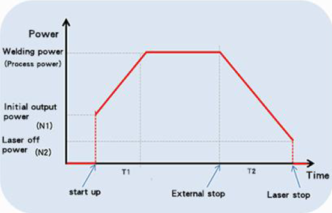
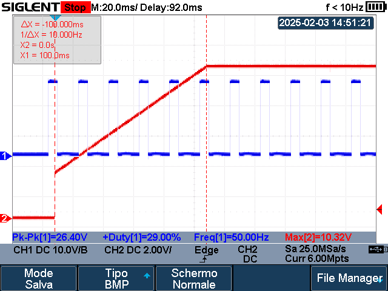
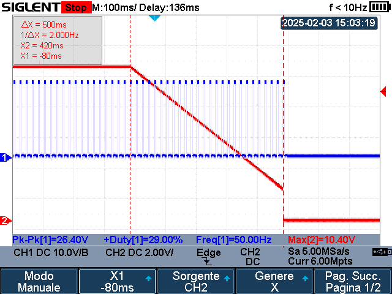
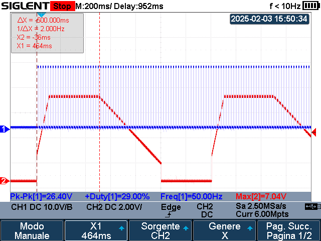
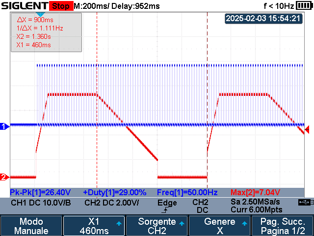
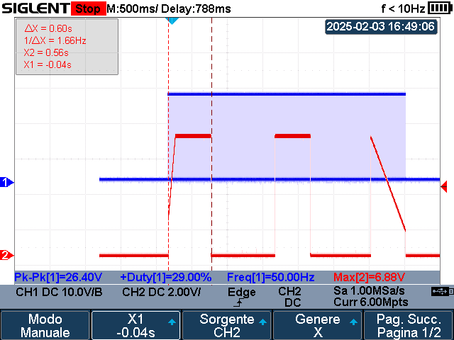
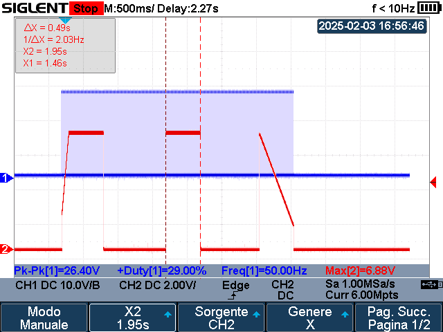
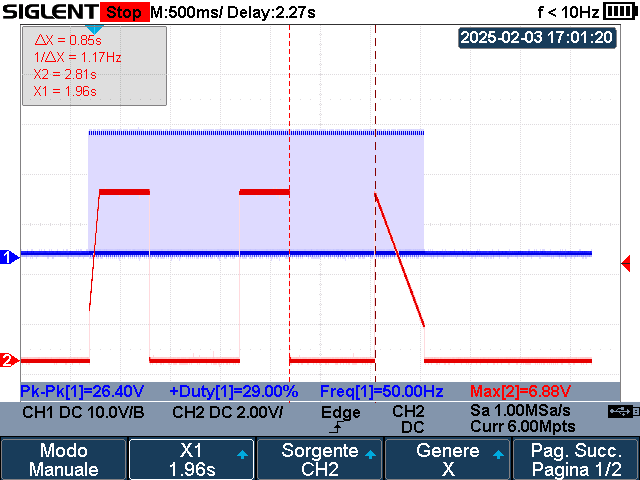

# Parameters used by the system

*   **Sacan Speed (mm/s)**: 2-6000 mm/s
*   **Sacan Width mm**: 0-6 mm, 

Both constrained to 

$$
f = \frac{\textrm{Scan Speed}}{2 * \textrm{Scan Width}} Hz
$$
  
$$
10 Hz \leq f \leq 1000 Hz
$$

If the value
 is set outside of this range, it will be overwriten with the closest limit
*   **Duty Cycle (%)**: Percentage of time of laser on in a pulse cycle
*   **Frequecy (Hz)**: number of pulse cycles per second. Absolute range $[5, 5000]$ Hz, recomended 2kHz fixed
*   **Opening Gas Delay (ms)**: Delay for the opening of the gas valve after triggering the laser gun
*   **Closing Gas Delay (ms)**: Delay for the closing of the gas valve after the laser has turend off. Absolute range is $[0, 3000]$ ms, recomended range is $[200, 500]$ ms
*   **Welding wire delay (ms)**: Wire feeding advance time relative to the light emitting signal. Absolute range is $[0, 3000]$ ms, recomended range is $[200, 500]$ ms
*   **Scan correction**: Scanning correction coeficient given by

$$
\textrm{Scan correction} = \frac{\textrm{Target Linewidth}}{\textrm{Measured Linewidth}}
$$

Absolute range is $[0.01, 4]$
*   **Laser center offset (mm)**: Laser centering offset. Absolute range is $[-3, 3]$ mm (negative implies offset to the left)
*   **Motor drive temperature threshold (ºC)**: Min/max value of the motor's drive temperature for the alarm, depending if the alarm is set to low/high level
*   **Protective mirror temperature threshold (ºC)**: Min/max value of the protective mirror temperature for the alarm, depending if the alarm is set to low/high level
*   **Collimator temperature threshold (ºC)**: Min/max value of the collimator temperature for the alarm, depending if the alarm is set to low/high level
*   **Laser alarm level**: TBD
*   **Chiller alarm level**: TBD
*   **Pressure alarm level**: TBD

## Laser Power Curve

*   **Laser Power (W)**: Stable power after the progressive ON time
*   **Peak Power (W)**: must be less that or equal to the `Laser Power` parameter
*   **Laser Starting Power (% Laser Power)**: percentage of `Laser Power` that is applied when the laser is triggered (N1 on graph)
*   **Laser On Progressive time (ms)**: Time to go from the `Laser Starting Power` to the `Laser Power` (T1 on graph)
*   **Laser Off Power (% Laser Power)**: percentage of `Laser Power` that is applied before the laser turns off (N2 on graph)
*   **Laser Off progressive time (ms)**: Time to go from the `Laser Power` to the `Laser Off Power` (T2 on graph)

## Spot Welding Mode Only

*   **Spot welding type**: Type of spot weldig (continuous / fish scale)
*   **Spot Welding duration (ms)**: TBD (the amount of time the laser is active)
*   **Spot Welding interval (ms)**: TBD (amount of time the laser is off before turning back on)
*   **Wire(s) Feed (cm/min)**: speed for soldering wires

---
# Signals / Indicators
*   **Laser Enable**: Enable/disable laser emision
*   **Indication of red light**: Type of laser guide (dot / line)
*   **Welding Mode**: Welding mode operation (continuous / spot)
*   **Secure Lock**: TBD (probably some kind of sequrity measurement)
---

# Experiments
**Note**: `Laser Power` refers to the absolute maximum power configured for the machine. `Laser peak power` refers to the maximum power for the power curved showed above (steady state power). Thus the following relation can be extracted

$$
\textrm{Power Analog Output} = \frac{\textrm{Peak Power}}{\textrm{Laser Power}} * 10V
$$

## Continuous welding mode
**Test setup**:  
*   PWM: Frequency =  50Hz, Duty Cycle = 30%
*   Laser power = 3KW, Peak power = 3KW, 
*   Power laser starting = 30%,  Laser on progressive time = 100ms, 
*   Laser power off = 20%, Laser off progressive time = 500ms

Legend: PWM in CH1 (blue), Power Analog Output CH2 (red)

The rising ramp occurs just when the trigger is pulled. Once reached the `Peak Power`, it will remain constant to this value until the trigger is relased. When the trigger is released, the falling ramp is performed and then the laser shuts down. In the event of an alarm, the laser power analog output will be set to zero immediately.

## Spot (Interval) welding mode

In this case, for every pulse, the power profile is fulfilled. The power output becomes a periodic signal with period 

$$
\begin{aligned}
    \textrm{T} = \textrm{Spot Welding Duration} + \textrm{Spot Welding Interval} \\
    \textrm{Spot Welding Duration} \geq \textrm{Laser ON progressive time} \\
    \textrm{Spot Welding Interval} \geq \textrm{Laser OFF progressive time} \\
\end{aligned}
$$

**Test setup**: 
*   PWM: Frequency =  50Hz, Duty Cycle = 30%
*   Laser power 3KW, Peak power 2KW 
*	Laser on progressive time = 100ms, Power laser starting = 30%,  
*	Laser off progressive time = 500ms, Laser power off = 20%
*	Spot welding duration = 500 ms
*	Spot welding interval = 900 ms

Legend: PWM in CH1 (blue), Power Analog Output CH2 (red)

## Spot (Fish Scale) welding mode

In this operating mode,  
1.  When the trigger of the laser gun is pressed, the rising ramp is performed until the `Peak power` is reached. 
2.  Then, the analog power output remains at `Peak power` for a time equal to the `Spot welding duration` time
3.  After that, the power is set to zero for a period of time equal to the `Spot welding interval` time, without performing the ramp down.
4.  For the next cycle, instead of doing the ramp up, the power voltage is set to `Peal power` instantly for a time equal to `Spot welding duration` time and then goes back to zero for a time equal to the `Spot welding interval` time.
5.  The no-ramps cycle repeats until the trigger is released.
6.  When the trigger is released, the power ramp down is performed.

**Test setup**: 
*   PWM: Frequency =  50Hz, Duty Cycle = 30%
*   Laser power 3KW, Peak power 2KW 
*	Laser on progressive time = 100ms, Power laser starting = 30%,  
*	Laser off progressive time = 500ms, Laser power off = 20%
*	Spot welding duration = 500 ms
*	Spot welding interval = 900 ms

Legend: PWM in CH1 (blue), Power Analog Output CH2 (red)

